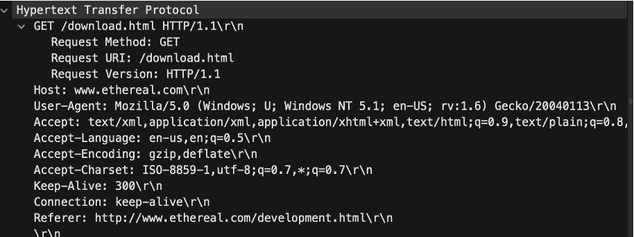
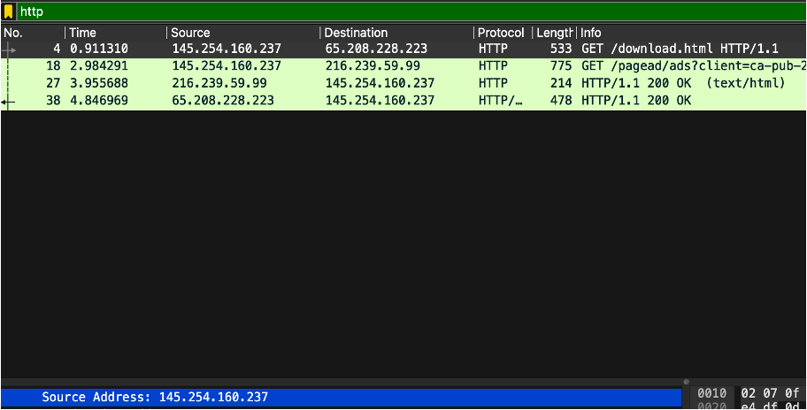
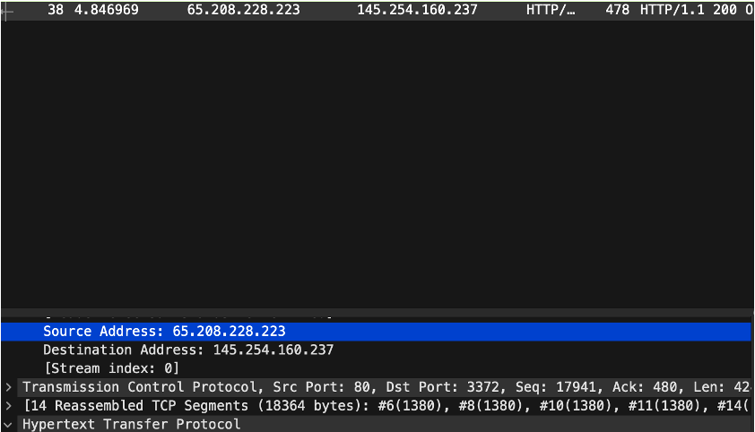
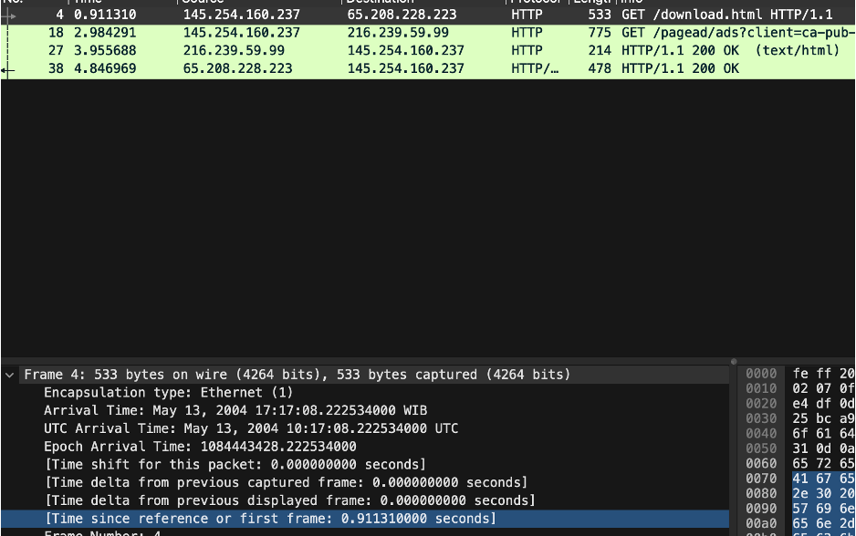
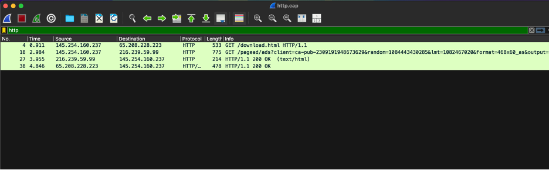
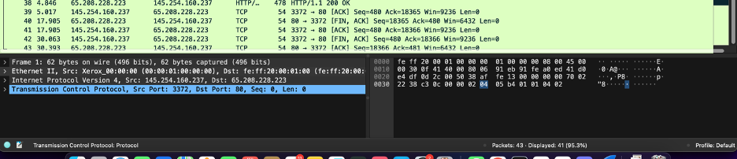
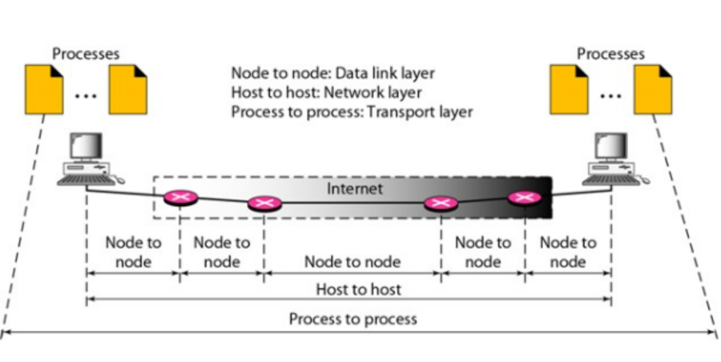

<div align="center">
  <h2 style="text-align: center;font-weight: bold">LAPORAN PRAKTIKUM <br/> WORKSHOP ADMINISTRASI JARINGAN</br></h2>
  <h4 style="text-align: center;">Dosen Pengampu : Dr. Ferry Astika Saputra, S.T., M.Sc.</h4>
</div>
<br />
<div align="center">
  
  <h3 style="text-align: center;">Disusun Oleh : </h3>
  <p style="text-align: center;">
    <strong>Ghaly Abrarian Putra (3123500018)</strong><br>
  </p>

<h3 style="text-align: center;line-height: 1.5">Politeknik Elektronika Negeri Surabaya<br>Departemen Teknik Informatika Dan Komputer<br>Program Studi Teknik Informatika<br>2025/2026</h3>
  <hr><hr>
</div>

<h3 style="text-align: center;line-height: 1.5">Tugas Review</h3>

### 1. Analisa file http.cap dengan wireshark:

#### a. Versi HTTP


Kesimpulan : versi http yang digunakan dalam permintaan ini menggunakan HTTP/1.1 keuntungan menggunakan HTTP 1.1 ialah didesign cenderung lebih effisien dalam penggunaan koneksi (tetap terbuka melalui keep-alive), mendukung pipelining ini seperti konsep Dimana untuk fungsi permintaan sehingga tidak perlu menunggu response dari permmintaan sebelumnya melainkan bisa melakukan permintaan secara sequence sesuai urutan.

#### b. Ip address client (145.254.168.237)


Kesimpulan :
Pertama pada INFO “GET /download.html” saya meminta dengan method GET ke server dengan ini bisa disimpulkan yang meminta adalah source (sumber) yaitu IP Address saya : 145.254.168.237

#### c. Ip address server (65.208.228.223)


Kesimpulan :
setelah client meminta request GET pada sebelumnya, kemudian server menjawab dengan response status 200 OK, artinya pada tahap ini Server sebagai source dan client sebagai destinantion, untuk IP Servernya : 65.208.228.223

#### d. Waktu dari client mengirimkan HTTP Request


Kesimpulan : berdasarkan time since reference or first frame yang di capture oleh wireshark terhadap request GET dari client menunjukan respon dengan second 9.3ms atau dapat diartikan terjadi pada detik 0.91132

#### e. Waktu dari server mengirimkan dan durasinya


Dari gambar tersebut dapat disimpulan bahwa response dari server menunjukan terjadi pada tahap paket ke 38 pada 4.846ms

---



Dari gambar yang kita dapat dan lihat Bersama dapat disimpulkan untuk durasi pengiriman response dari server dengan menghitung selisi waktu antara nomor 38 (http response) dan frame 40 ([FIN,ACK]) dari server

1. Cari waktu pengiriman HTTP response (frame 38)
   : waktu 8.846ms
2. Cari waktu pengiriman terakhir dari server dengan flag FIN,ACK pada frame 40
   : waktu 17.963ms
3. Menghitung durasi respons server :
   17.963ms – 8.846ms = 9.117ms
4. Durasi pengiriman respon oleh server hingga sampai dengan koneksi antar server dan client bisa dikatakan :
   total durasi yaitu 22.117 ms (frame 42 – frmae 38)

---

### 2. Deskripsi Gambar Slide 3


Umumnya penggunaan computer yang memang memerlukan internet bisa kita katakana bahwasanya aslinya computer itu sedang saling bertukar informasi alias berkomunikasi, antara computer yang meminta maupun yang melayani, sebagai contoh Ketika kita membuka google.com maka yang terjadi computer kita berkomunikasi dengan computer google.com untuk menyalurkan informasi yang computer kita inginkan, dalam tahap tersebut pasti selalu melalui berberapa tahapan lapisan jaringan :

-----


Peran dari masing masing Lapisan :
1. Data link : peran data link umumnya untuk mengatur komunikasi langsung antar perangkat yang terhubung secara fisik (fiber,lan dsb), pada tahapan ini data akan di ubah menjadi frame yang bisa dikirim melalui fisik, pada tahap ini juga memiliki peran physical addressing yang menggunakan MAC addres untuk mengindentifikasi perangkat di jaringan local
2. Network : peran network layer umumnya berperan mengatur logical address dengan menggunakan ip address, pada tahap ini juga akan terjadi proses kalkulasi rute terbaik salah satu algoritma yang diunakan adalah djikstra dan lain-lain
3. Transport : peran tahapan transport ini mengatur komunikasi antar aplikasi di berbagai perangkat, pada tahap ini data akan dipastikan dikirim dengan membagi data menjadi bagian-bagian kecil atau yang disebut segmentation dan reassembly 


### 3. Rangkuman Tahapan Komunikasi Menggunakan TCP

TCP adalah protocol yang digunakan untuk mengirim data di jaringan dengan cara aman dan andal, mengapa andal? Karena protocol ini akan selalu memastikan data yang dikirim sama sampe tujuan.

#### a. Membangun Koneksi (Three-Way Handshake)
Untuk tahap ini umumnya TCP akan memastikan kedua belah pihak siap untuk berkomunikasi, ada berberapa Langkah pada tahap ini 

``` 
- SYN: Client mengirimkan paket SYN (synchronize) ke server untuk meminta memulai koneksi.
- SYN-ACK: Server merespon dengan paket SYN-ACK (synchronize-acknowledge) untuk mengonfirmasi permintaan.
- ACK: Klien mengirimkan paket ACK (acknowledge) sebagai balasan, dan koneksi pun terbentuk. 
```

#### b. Pengiriman Data

Setelah tahap ACK, data akan dibagi menjadi berberapa paket kecil dan dikirim, setiap paket akan diberi nomor agar penerima dapat menyusunnya Kembali dengan mudah artinya jika terjadi kehilangan paket alias nomor lompat maka penerima akan meminta Kembali paketnya ke pengirim supaya dapat tersusun seperti urutan nomor tanpa terlewat satupun

#### c. Menutup Koneksi (Four-way handshake) 
Four-way handsake merupakan cara protocol TCP menutup komunikasi setelah tahap komunikasi berakhir / selesai, nah pada tahap ini juga memiliki berapa Langkah seperti tahap komunikasi di buka / di buat, berikut tahapannya :

```
FIN : Pengirim mengirimkan sinyal (FIN) finish ke penerima untuk memberi tahu bahwa pengirim sudah selesai keseluruhan mengirim data yang diminta serta memberikan komunikasi bahwa pengirim ingin menutup Komunikasi
ACK : Penerima menerima sinyal FIN dan mengirimkan balasan ACK guna memberikan balasan kepada pengirim bahwa penerima telah menerima permintaan penutupan koneksi
FIN : Penerima kemudian mengirimkan sinyal FIN ke pengirim untuk memberitahukan bahwa penerima juga siap menutup koneksi
ACK : pengirim menerima sinyal FIN dan Mengirim balasan ACK untuk mengkonfirmasi bahwa koneksi dapat ditutup sepenuhnya.
```