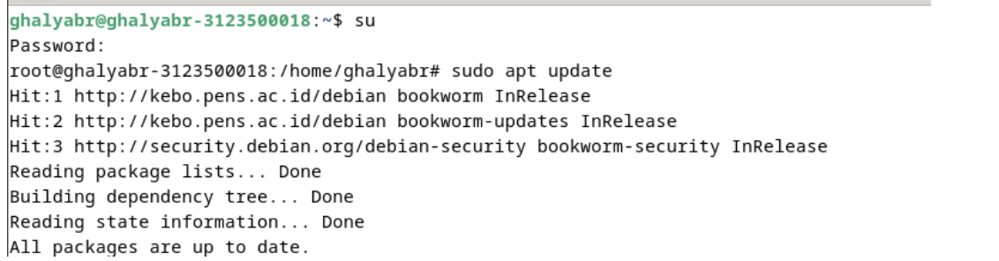
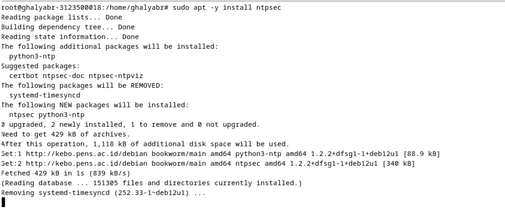
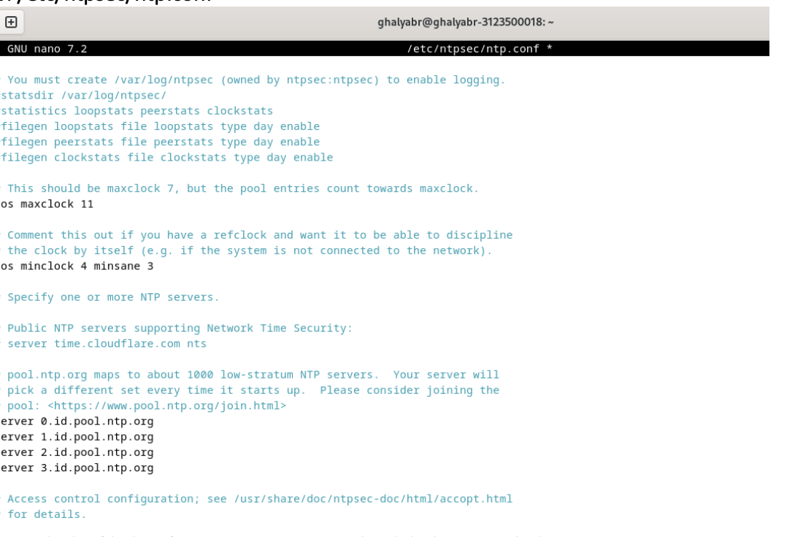
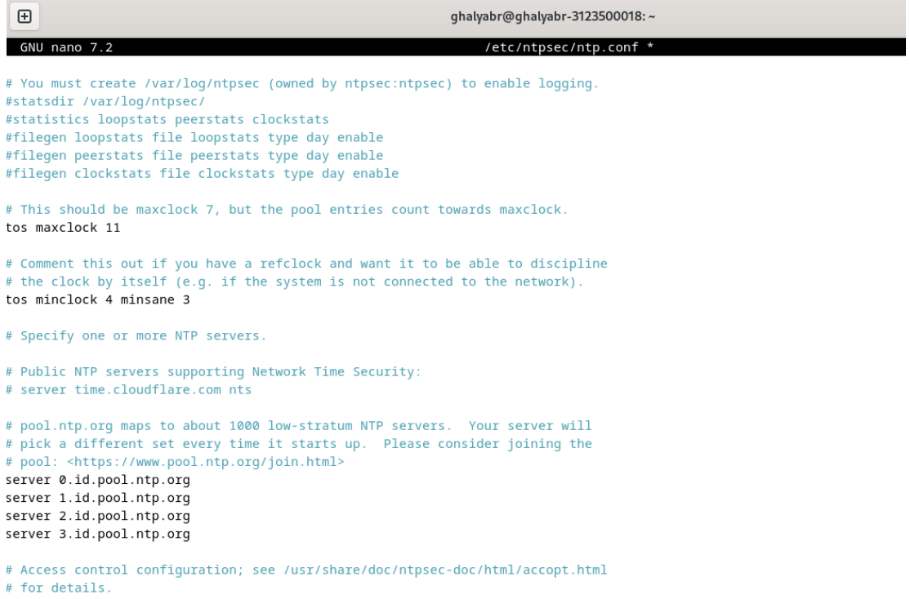
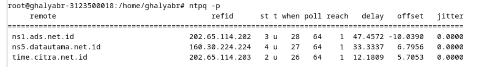
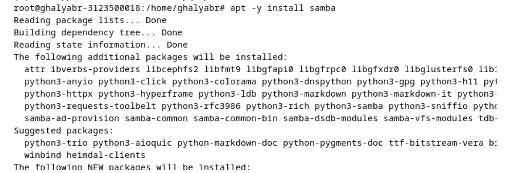
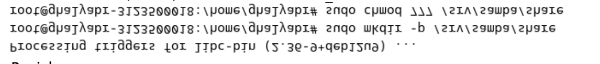
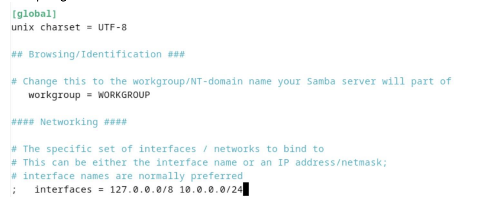
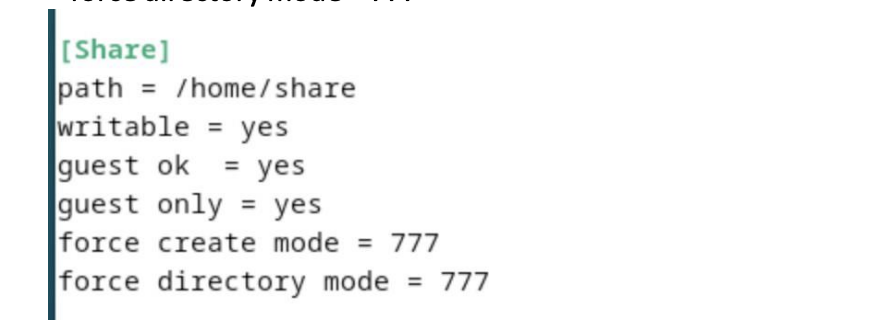

<div align="center">
  <h1 style="text-align: center;font-weight: bold">Praktikum 3<br>Admin Jaringan</h1>
  <h4 style="text-align: center;">Dosen Pengampu : Dr. Ferry Astika Saputra, S.T., M.Sc.</h4>
</div>
<br />
<div align="center">
  
  <h3 style="text-align: center;">Disusun Oleh : </h3
  <p style="text-align: center;">
    <strong>Nama : Ghaly Abrarian</strong><br>
    <strong>Kelas : 2 D3 IT A</strong><br>
    <strong>NRP : 3123500018</strong>
  </p>

<h3 style="text-align: center;line-height: 1.5">Politeknik Elektronika Negeri Surabaya<br>Departemen Teknik Informatika Dan Komputer<br>Program Studi Teknik Informatika<br>2024/2025</h3>
  <hr><hr>
</div>

## Daftar Isi

## [Konfigurasi dan Instalasi NTPsec](#konfigurasi-dan-instalasi-ntpsec)

- [1. Perbarui Daftar Paket](#1-perbarui-daftar-paket)
- [2. Instalasi NTPsec](#2-instalasi-ntpsec)
- [3. Edit File Konfigurasi NTPsec](#3-edit-file-konfigurasi-ntpsec)
- [4. Modifikasi Konfigurasi](#4-modifikasi-konfigurasi)
- [5. Restart Layanan NTPsec](#5-restart-layanan-ntpsec)
- [6. Verifikasi Status Sinkronisasi](#6-verifikasi-status-sinkronisasi)

## [Instalasi dan Konfigurasi Samba](#instalasi-dan-konfigurasi-samba)

- [1. Instalasi Samba](#1-instalasi-samba)
- [2. Membuat dan Mengatur Izin Folder Share](#2-membuat-dan-mengatur-izin-folder-share)
- [3. Mengedit Konfigurasi Samba](#3-mengedit-konfigurasi-samba)
  - [Bagian Global](#bagian-global)
  - [Menambahkan Konfigurasi Share di Bagian Akhir File](#menambahkan-konfigurasi-share-di-bagian-akhir-file)
- [4. Merestart Layanan Samba](#4-merestart-layanan-samba)
- [5. Coba Akses](#5-coba-akses)
  - [Akses melalui Debian](#akses-melalui-debian)
  - [Akses melalui MacOs](#akses-melalui-macos)

## [Rangkuman Package Management (Manajemen Paket) dalam Debian 12](#rangkuman-package-management-manajemen-paket-dalam-debian-12)

- [1. dpkg (Debian Package Manager)](#1-dpkg-debian-package-manager)
- [2. APT (Advanced Package Tool)](#2-apt-advanced-package-tool)
- [3. Manajemen Repositori](#3-manajemen-repositori)
- [4. Menggunakan APT dengan Cache dan Dependensi](#4-menggunakan-apt-dengan-cache-dan-dependensi)
- [5. Menggunakan Snap dan Flatpak](#5-menggunakan-snap-dan-flatpak)
  - [Instalasi Snap](#instalasi-snap)
  - [Instalasi Flatpak](#instalasi-flatpak)
- [Kesimpulan](#kesimpulan)

# Konfigurasi dan Instalasi NTPsec

### 1. Perbarui Daftar Paket

```bash
sudo apt update
```


Memperbarui daftar paket sistem agar mendapatkan versi terbaru dari repositori.

### 2. Instalasi NTPsec

```bash
sudo apt -y install ntpsec
```


Menginstal **NTPsec**, yaitu implementasi aman dari Network Time Protocol.

### 3. Edit File Konfigurasi NTPsec

```bash
vi /etc/ntpsec/ntp.conf
```


Membuka file konfigurasi **NTPsec** untuk dilakukan perubahan.

### 4. Modifikasi Konfigurasi



- **Baris 24**: Ubah nilai atau komentari jika hanya menggunakan server NTP tertentu.
  ```bash
  #tos minclock 4 minsane 3
  ```
- **Baris 34**: Komentari server default dan tambahkan server NTP sesuai zona waktu dapatvdilihat pada link berikut https://www.ntppool.org/en/zone/id.
  ```bash
      server 0.id.pool.ntp.org
  	  server 1.id.pool.ntp.org
  	  server 2.id.pool.ntp.org
  	  server 3.id.pool.ntp.org
  ```
  Simpan dan keluar dari editor.

### 5. Restart Layanan NTPsec

```bash
systemctl restart ntpsec
```


Menerapkan konfigurasi yang telah diubah dengan me-restart layanan **NTPsec**.

### 6. Verifikasi Status Sinkronisasi

```bash
ntpq -p
```

Memeriksa status server **NTP** yang digunakan dan memastikan sinkronisasi berjalan dengan baik.

#### Contoh hasil keluaran:



- `*` menunjukkan server utama yang digunakan.
- `+` menandakan server tambahan yang aktif.

---

# Instalasi dan Konfigurasi Samba

## 1. Instalasi Samba

Jalankan perintah berikut untuk menginstal Samba di sistem berbasis Debian/Ubuntu:

```bash
apt -y install samba
```



### Penjelasan:

- `apt` → Manajer paket untuk menginstal perangkat lunak.
- `-y` → Menyetujui instalasi secara otomatis tanpa konfirmasi pengguna.
- `install samba` → Memasang paket Samba untuk berbagi file di jaringan.

---

## 2. Membuat dan Mengatur Izin Folder Share

```bash
sudo mkdir /home/share
sudo chmod 777 /home/share
```



### Penjelasan:

- `mkdir /home/share` → Membuat direktori `/home/share` yang akan digunakan sebagai folder berbagi.
- `chmod 777 /home/share` → Memberikan izin penuh agar semua pengguna dapat membaca, menulis, dan mengeksekusi file dalam folder tersebut.

---

## 3. Mengedit Konfigurasi Samba

Buka file konfigurasi Samba menggunakan editor teks:

```bash
sudo nano /etc/samba/smb.conf
```


Tambahkan atau ubah bagian berikut dalam file konfigurasi:

### **Bagian Global**

```ini
[global]
   # Mengatur charset untuk mendukung Unicode
   unix charset = UTF-8

   # Menentukan interface jaringan yang diizinkan
   interfaces = 127.0.0.0/8 10.0.0.0/24

   # Mengaktifkan akses tamu (tanpa autentikasi)
   map to guest = bad user
```



### **Menambahkan Konfigurasi Share di Bagian Akhir File**

```ini
[Share]
   path = /home/share
   writable = yes
   guest ok = yes
   guest only = yes
   force create mode = 777
   force directory mode = 777
```


### Penjelasan:

- **`path = /home/share`** → Folder yang akan dibagikan.
- **`writable = yes`** → Mengizinkan pengguna untuk menulis, mengedit, dan menghapus file.
- **`guest ok = yes`** → Mengizinkan akses tanpa autentikasi.
- **`guest only = yes`** → Semua pengguna dianggap sebagai pengguna tamu (guest).
- **`force create mode = 777`** → Semua file yang dibuat memiliki izin penuh.
- **`force directory mode = 777`** → Semua folder yang dibuat memiliki izin penuh.

---

## 4. Merestart Layanan Samba

Setelah melakukan konfigurasi, restart layanan Samba agar perubahan diterapkan:

```bash
systemctl restart smbd
```

### Penjelasan:

- `systemctl restart smbd` → Me-restart layanan Samba (`smbd`) untuk menerapkan perubahan konfigurasi.

---

## 5. Coba Akses

### Akses melalui debian


### Akses melalui MacOs


---

# Rangkuman Package Management (Manajemen Paket) dalam Debian 12

---

Manajemen paket dalam Debian 12 berfungsi untuk menginstal, memperbarui, dan menghapus perangkat lunak dalam sistem. Debian menggunakan sistem manajemen paket **dpkg** dan **APT (Advanced Package Tool)** untuk mengelola software.

## 1. dpkg (Debian Package Manager)

**dpkg** adalah alat dasar untuk mengelola paket `.deb` di Debian.

### Perintah utama:

```bash
dpkg -i <nama_paket>.deb  # Menginstal paket
dpkg -r <nama_paket>       # Menghapus paket
dpkg -l                   # Menampilkan daftar paket yang terinstal
dpkg -S <file>            # Menemukan paket yang memiliki file tertentu
```

## 2. APT (Advanced Package Tool)

**APT** adalah alat tingkat tinggi yang digunakan untuk menangani dependensi paket dan mengunduh paket dari repositori.

### Perintah utama:

```bash
apt update                # Memperbarui daftar paket
apt upgrade               # Memperbarui semua paket yang sudah terinstal
apt install <nama_paket>  # Menginstal paket
apt remove <nama_paket>   # Menghapus paket
apt search <nama_paket>   # Mencari paket yang tersedia
```

## 3. Manajemen Repositori

Paket diunduh dari repositori resmi Debian yang terdaftar di file `/etc/apt/sources.list`.

Untuk menambahkan repositori pihak ketiga, bisa menggunakan:

```bash
echo "deb http://example.com/debian stable main" | sudo tee -a /etc/apt/sources.list
sudo apt update
```

## 4. Menggunakan APT dengan Cache dan Dependensi

```bash
apt-cache search <nama_paket>  # Mencari informasi paket
apt-cache show <nama_paket>    # Menampilkan detail paket
apt autoremove                 # Menghapus paket yang tidak diperlukan
```

## 5. Menggunakan Snap dan Flatpak

**Snap** dan **Flatpak** adalah alternatif untuk menginstal aplikasi yang lebih modern dan cross-platform.

### Instalasi Snap:

```bash
apt install snapd
snap install <nama_paket>
```

### Instalasi Flatpak:

```bash
apt install flatpak
flatpak install flathub <nama_paket>
```

## Kesimpulan

Debian 12 menawarkan berbagai cara untuk mengelola paket, baik dengan **dpkg**, **APT**, maupun sistem modern seperti **Snap** dan **Flatpak**. Penggunaan **APT** sangat direkomendasikan karena dapat menangani dependensi secara otomatis dan mempermudah pengelolaan software dalam sistem Debian.
